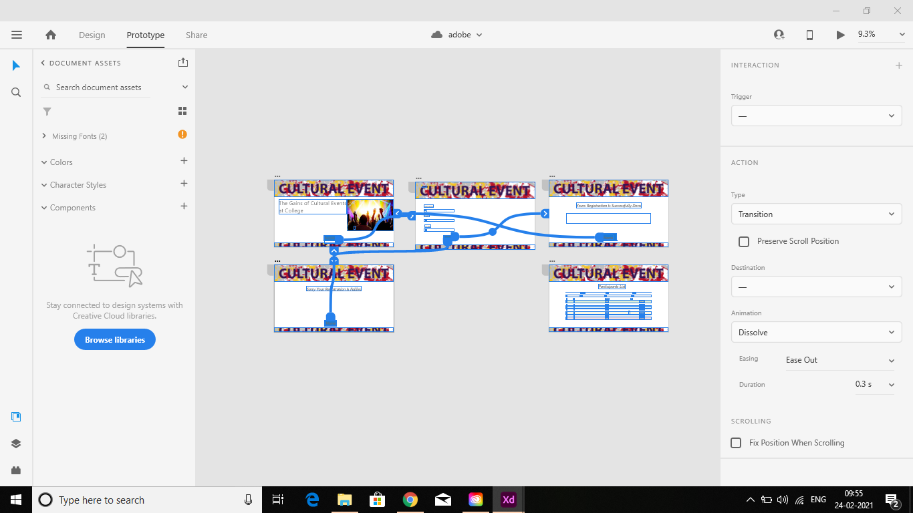

# WebApplication for Event Registration

## AIM:
To create a UX design and develop a web application for event registration.
## DESIGN STEPS:
### Step 1: 
Requirement collection.
### Step 2:
Creating the layout using HTML and CSS.
### Step 3:
Updating the sample content.
### Step 4:
Choose the appropriate style and color scheme.
### Step 5:
Validate the layout in various browsers.
### Step 6:
Validate the HTML code.
### Step 7:
Create a database model and migrate the database.
### Step 8:
Retrieve data from database and display it in a dynamic webpage.
### Step 9:
Publish the website in the given URL


## DESIGN SCREENS:


## WIREFRAME:


## PROTOTYPE:


## PROGRAM:

### home.html
```
<!doctype html>
<html lang="en">

<head>
    <!-- Required meta tags -->
    <meta charset="utf-8">
    <meta name="viewport" content="width=device-width, initial-scale=1, shrink-to-fit=no">

    <!-- Bootstrap CSS -->
    <link rel="stylesheet" href="https://maxcdn.bootstrapcdn.com/bootstrap/4.0.0/css/bootstrap.min.css"
        integrity="sha384-Gn5384xqQ1aoWXA+058RXPxPg6fy4IWvTNh0E263XmFcJlSAwiGgFAW/dAiS6JXm" crossorigin="anonymous">

    <title>Event Registration</title>
</head>

<body style="background-color: rgb(243, 201, 85);">
    <div class="jumbotron text-center" style="background-color: rgb(243, 201, 85);">
        <h1 class="display-4">Workshop on IOT</h1>
        <p class="lead">Join with us!!!</p>
        <hr class="my-4 text-right">
        <p class="lead">
            <a class="btn btn-primary btn-lg" href="#" role="button">Learn more</a>
        </p>
    </div>
    <div class="container">
        <div class="row">
            <div class="card bg-dark text-white col-lg-12">
                <h5 class=" card-text display-4 font-weight-bold">One day workshop on Internet of Things</h5>
            </div>
        </div>
    </div>
    <div>
        <div class="container" style="background-color: rgb(221, 172, 37);">
            <div class="row">
                <p><strong>Not only are we looking forward to being back in person for IoT World 2021, but after the
                        huge success in attracting international attendees from 94 countries to IoT World Virtual in
                        August 2020, the 2021 event will now also leverage the capabilities of reaching a global
                        audience by being a hybrid event. We will now be able to connect the in-person North American
                        audience, to the online global audience at IoT World, for the very first time. As a result, the
                        previous IoT World Europe, IoT World Asia, IoT World China and IoT World Africa will now be held
                        virtually, during IoT World, creating a global festival of IoT innovation.</strong></p>
                        <div class="card" style="width: 18rem;">
  
  <div class="card-body">
  </div>
</div>
            </div>
        </div>
    </div>
    <div class="text-center">
        <a class="btn btn-info btn-lg text center" href="/register/" role="button">Register</a>
    </div>
    <div class="card bg-dark text-white col-lg-12">
        <div class="card-img-overlay text-center">
            <p><strong>Designed by Durgadevi</strong></p>
        </div>
    </div>


    <!-- Optional JavaScript -->
    <!-- jQuery first, then Popper.js, then Bootstrap JS -->
    <script src="https://code.jquery.com/jquery-3.2.1.slim.min.js"
        integrity="sha384-KJ3o2DKtIkvYIK3UENzmM7KCkRr/rE9/Qpg6aAZGJwFDMVNA/GpGFF93hXpG5KkN"
        crossorigin="anonymous"></script>
    <script src="https://cdnjs.cloudflare.com/ajax/libs/popper.js/1.12.9/umd/popper.min.js"
        integrity="sha384-ApNbgh9B+Y1QKtv3Rn7W3mgPxhU9K/ScQsAP7hUibX39j7fakFPskvXusvfa0b4Q"
        crossorigin="anonymous"></script>
    <script src="https://maxcdn.bootstrapcdn.com/bootstrap/4.0.0/js/bootstrap.min.js"
        integrity="sha384-JZR6Spejh4U02d8jOt6vLEHfe/JQGiRRSQQxSfFWpi1MquVdAyjUar5+76PVCmYl"
        crossorigin="anonymous"></script>
</body>

</html>

```
### failed.html
```
<!doctype html>
<html lang="en">
  <head>
    <!-- Required meta tags -->
    <meta charset="utf-8">
    <meta name="viewport" content="width=device-width, initial-scale=1, shrink-to-fit=no">

    <!-- Bootstrap CSS -->
    <link rel="stylesheet" href="https://maxcdn.bootstrapcdn.com/bootstrap/4.0.0/css/bootstrap.min.css" integrity="sha384-Gn5384xqQ1aoWXA+058RXPxPg6fy4IWvTNh0E263XmFcJlSAwiGgFAW/dAiS6JXm" crossorigin="anonymous">

    <title>Event Registration</title>
  </head>
  <body>
    <div class="jumbotron jumbotron-fluid text-center">
    <h5 class=" card-text display-4 font-weight-bold">Worshop on IOT</h5>
    <p class="card-text font-weight-bold">LIGHT UP THE IOT</p>
    </div>
    <div class="container">
        <div class="row">
            <div class="card bg-dark text-white col-lg-12">
    <h5 class=" card-text display-4 font-weight-bold">One day workshop on Internet of Things</h5>            
		</div>
    </div>
</div>
<div class="container">
    <div class="row">
        <div class="alert alert-danger" role="alert">
  <h4 class="alert-heading">sorry!</h4>
  <p>Your request has been failed!!!</p> 
</div>
    </div>
        </div>
<div class="text-center">
    <a class="btn btn-info btn-lg text center" href="/register/" role="button">Register</a>
  </div>
        <div class="card bg-dark text-white col-lg-12">
  <div class="card-img-overlay text-center" >
      <p><strong>Designed by Durgadevi</strong></p>
    </div>
         </div>

    <!-- Optional JavaScript -->
    <!-- jQuery first, then Popper.js, then Bootstrap JS -->
    <script src="https://code.jquery.com/jquery-3.2.1.slim.min.js" integrity="sha384-KJ3o2DKtIkvYIK3UENzmM7KCkRr/rE9/Qpg6aAZGJwFDMVNA/GpGFF93hXpG5KkN" crossorigin="anonymous"></script>
    <script src="https://cdnjs.cloudflare.com/ajax/libs/popper.js/1.12.9/umd/popper.min.js" integrity="sha384-ApNbgh9B+Y1QKtv3Rn7W3mgPxhU9K/ScQsAP7hUibX39j7fakFPskvXusvfa0b4Q" crossorigin="anonymous"></script>
    <script src="https://maxcdn.bootstrapcdn.com/bootstrap/4.0.0/js/bootstrap.min.js" integrity="sha384-JZR6Spejh4U02d8jOt6vLEHfe/JQGiRRSQQxSfFWpi1MquVdAyjUar5+76PVCmYl" crossorigin="anonymous"></script>
  </body>
</html>

```
### success.html
```
<!doctype html>
<html lang="en">
  <head>
    <!-- Required meta tags -->
    <meta charset="utf-8">
    <meta name="viewport" content="width=device-width, initial-scale=1, shrink-to-fit=no">

    <!-- Bootstrap CSS -->
    <link rel="stylesheet" href="https://maxcdn.bootstrapcdn.com/bootstrap/4.0.0/css/bootstrap.min.css" integrity="sha384-Gn5384xqQ1aoWXA+058RXPxPg6fy4IWvTNh0E263XmFcJlSAwiGgFAW/dAiS6JXm" crossorigin="anonymous">

    <title>Event Registration</title>
  </head>
  <body>
    <div class="jumbotron jumbotron-fluid text-center">
    <h5 class=" card-text display-4 font-weight-bold">Worshop on IOT</h5>
    <p class="card-text font-weight-bold">LIGHT UP THE IOT</p>
    </div>
    <div class="container">
        <div class="row">
            <div class="card bg-dark text-white col-lg-12">
    <h5 class=" card-text display-4 font-weight-bold">One day workshop on Internet of Things</h5>            
		</div>
    </div>
</div>
<div class="container">
        <div class="row">
  <h4 class="alert-heading">Congrats!</h4>
  <p>Your request has been accepted!!!</p> 
</div>
        </div>
<div class="text-center">
    <a class="btn btn-info btn-lg text center" href="/register/" role="button">Register</a>
  </div>
        <div class="card bg-dark text-white col-lg-12">
  <div class="card-img-overlay text-center" >
      <p><strong>Designed by Durgadevi</strong></p>
    </div>
         </div>

    <!-- Optional JavaScript -->
    <!-- jQuery first, then Popper.js, then Bootstrap JS -->
    <script src="https://code.jquery.com/jquery-3.2.1.slim.min.js" integrity="sha384-KJ3o2DKtIkvYIK3UENzmM7KCkRr/rE9/Qpg6aAZGJwFDMVNA/GpGFF93hXpG5KkN" crossorigin="anonymous"></script>
    <script src="https://cdnjs.cloudflare.com/ajax/libs/popper.js/1.12.9/umd/popper.min.js" integrity="sha384-ApNbgh9B+Y1QKtv3Rn7W3mgPxhU9K/ScQsAP7hUibX39j7fakFPskvXusvfa0b4Q" crossorigin="anonymous"></script>
    <script src="https://maxcdn.bootstrapcdn.com/bootstrap/4.0.0/js/bootstrap.min.js" integrity="sha384-JZR6Spejh4U02d8jOt6vLEHfe/JQGiRRSQQxSfFWpi1MquVdAyjUar5+76PVCmYl" crossorigin="anonymous"></script>
  </body>
</html>

```
### participant.html
```
<!doctype html>
<html lang="en">
  <head>
    <!-- Required meta tags -->
    <meta charset="utf-8">
    <meta name="viewport" content="width=device-width, initial-scale=1, shrink-to-fit=no">

    <!-- Bootstrap CSS -->
    <link rel="stylesheet" href="https://maxcdn.bootstrapcdn.com/bootstrap/4.0.0/css/bootstrap.min.css" integrity="sha384-Gn5384xqQ1aoWXA+058RXPxPg6fy4IWvTNh0E263XmFcJlSAwiGgFAW/dAiS6JXm" crossorigin="anonymous">

    <title>Event Management</title>
  </head>
  <body>
     <div class="jumbotron jumbotron-fluid text-center">
    <div>
        <h5 class=" card-text display-4 font-weight-bold">Worshop on IOT</h5>
    <p class="card-text font-weight-bold">LIGHT UP THE IOT</p>
    </div>
    </div>  
    

  <div class="container">
        <div class="row">
    <h1>List of Participants</h1>
        <div class="row">
            <div class="col-12">
                <table class="table">
                    <thead>
                        <tr>
                            <th scope="col">NAME</th>
                            <th scope="col">PHONE</th>
                            <th scope="col">EMAIL</th>
                            <th scope="col">INSTITUTION</th>
                        </tr>
                    </thead>
                    <tbody>
                        
                        <tr>
                            <td>{{ p.username }}</td>
                            <td>{{ p.phone }}</td>
                            <td>{{ p.email }}</td>
                            <td>{{ p.institution }}</td>
                        </tr>
                        
                    </tbody>

                </table>

            </div>

        </div>
    </div>
        </div>
    <div class="col-12 text-center">
               <a class="btn btn-info btn-lg" href="/home/" role="button">Home</a>
            </div>
            <div class="card bg-dark text-white col-lg-12">>
  <div class="card-img-overlay text-center" >
      <p><strong>Designed by DurgaDevi</strong></p>
    </div>
         </div>

    <!-- Optional JavaScript -->
    <!-- jQuery first, then Popper.js, then Bootstrap JS -->
    <script src="https://code.jquery.com/jquery-3.2.1.slim.min.js" integrity="sha384-KJ3o2DKtIkvYIK3UENzmM7KCkRr/rE9/Qpg6aAZGJwFDMVNA/GpGFF93hXpG5KkN" crossorigin="anonymous"></script>
    <script src="https://cdnjs.cloudflare.com/ajax/libs/popper.js/1.12.9/umd/popper.min.js" integrity="sha384-ApNbgh9B+Y1QKtv3Rn7W3mgPxhU9K/ScQsAP7hUibX39j7fakFPskvXusvfa0b4Q" crossorigin="anonymous"></script>
    <script src="https://maxcdn.bootstrapcdn.com/bootstrap/4.0.0/js/bootstrap.min.js" integrity="sha384-JZR6Spejh4U02d8jOt6vLEHfe/JQGiRRSQQxSfFWpi1MquVdAyjUar5+76PVCmYl" crossorigin="anonymous"></script>
  </body>
</html>

```
### register.html
```
<!doctype html>
<html lang="en">

<head>
    <!-- Required meta tags -->
    <meta charset="utf-8">
    <meta name="viewport" content="width=device-width, initial-scale=1, shrink-to-fit=no">

    <!-- Bootstrap CSS -->
    <link rel="stylesheet" href="https://maxcdn.bootstrapcdn.com/bootstrap/4.0.0/css/bootstrap.min.css"
        integrity="sha384-Gn5384xqQ1aoWXA+058RXPxPg6fy4IWvTNh0E263XmFcJlSAwiGgFAW/dAiS6JXm" crossorigin="anonymous">

    <title>Event Management</title>
</head>

<body>
    <div class="jumbotron jumbotron-fluid text-center">
<div class="card bg-dark text-white">
  <div class="card-img-overlay">
    <h5 class=" card-text display-4 font-weight-bold">Worshop on IOT</h5>
    <p class="card-text font-weight-bold">LIGHT UP THE IOT</p>
    </div>
</div>
</div>
    <div class="container">
        <div class="row">
                <h1>Application</h1>
        <form action="/register/" method="POST">
            
            <div class="form-group">
                <label for="name">Name</label>
                <input type="name" class="form-control" name="username" id="username" aria-describedby="emailHelp"
                    placeholder="Enter name">
            </div>
            <div class="form-group">
                <label for="phone">Phone</label>
                <input type="phone" class="form-control" name="phone" id="phone" placeholder="Enter phone number">
            </div>
            <div class="form-group">
                <label for="exampleInputEmail1">Email address</label>
                <input type="email" class="form-control" name="email" id="email" aria-describedby="emailHelp"
                    placeholder="Enter email">
                <small id="emailHelp" class="form-text text-muted">We'll never share your email with anyone
                    else.</small>
            </div>
            <div class="form-group">
                <label for="institutionname">Institution name</label>
                <input type="institutionname" class="form-control" name="institution" id="institution"
                    placeholder="Enter institution name">
            </div>
            <div class="text-center">
                <button type="submit" class="btn btn-primary">Submit</button>
            </div>
        </form>
        </div>
        </div>
    <div class="card bg-dark text-white col-lg-12">
  <div class="card-img-overlay text-center" >
      <p><strong>Designed by Durgadevii</strong></p>
    </div>
         </div>


    <!-- Optional JavaScript -->
    <!-- jQuery first, then Popper.js, then Bootstrap JS -->
    <script src="https://code.jquery.com/jquery-3.2.1.slim.min.js"
        integrity="sha384-KJ3o2DKtIkvYIK3UENzmM7KCkRr/rE9/Qpg6aAZGJwFDMVNA/GpGFF93hXpG5KkN"
        crossorigin="anonymous"></script>
    <script src="https://cdnjs.cloudflare.com/ajax/libs/popper.js/1.12.9/umd/popper.min.js"
        integrity="sha384-ApNbgh9B+Y1QKtv3Rn7W3mgPxhU9K/ScQsAP7hUibX39j7fakFPskvXusvfa0b4Q"
        crossorigin="anonymous"></script>
    <script src="https://maxcdn.bootstrapcdn.com/bootstrap/4.0.0/js/bootstrap.min.js"
        integrity="sha384-JZR6Spejh4U02d8jOt6vLEHfe/JQGiRRSQQxSfFWpi1MquVdAyjUar5+76PVCmYl"
        crossorigin="anonymous"></script>
</body>

</html>

```
### views.py
```
from django.shortcuts import render

from .models import Participant

# Create your views here.
def home(request):
    context = {}
    return render(request, 'eventapp/home.html', context)

def register(request):
    context = {}
    if request.method == 'POST':
        p1 = Participant()
        p1.username = request.POST.get('username','_')
        p1.phone = request.POST.get('phone','000')
        p1.email = request.POST.get('email','_')
        p1.institution = request.POST.get('institution','_')

        if len(Participant.objects.all()) > 10:
            return render(request, 'eventapp/failed.html', context)
        else:
            p1.save()
            return render(request, 'eventapp/success.html', context)
    
    if request.method =='GET':
        context['username'] = ''
        context['phone'] = ''
        context['email'] = ''
        context['institution'] = ''
    return render(request, 'eventapp/register.html', context)

def participants(request):
    context = {}

    context["participants"] = Participant.objects.all();
    return render(request, 'eventapp/participants.html', context)

def failed(request):
    context = {}
    return render(request, 'eventapp/failed.html', context)

def success(request):
    context = {}
    return render(request, 'eventapp/success.html', context)

```

## OUTPUT:


## CODE VALIDATION REPORT:


## RESULT:
Thus create a UX design and develop a web application for event registration is created and is hosted in the URLs http://durgadevi.student.saveetha.in:8000/home/,http://durgadevi.student.saveetha.in:8000/register/,http://durgadevi.student.saveetha.in:8000/success ,HTML code is validated


